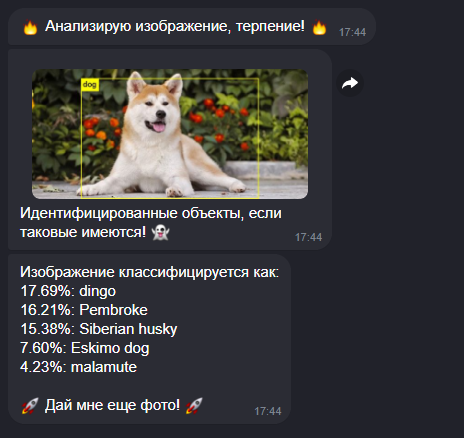

# ICQNNBot

ICQNNBot - Бот для ICQ использующий предобученную нейронную сеть. 
Бот работает по простому принципу. 

Пользователь отправляет боту фото чего либо, бот обрабатывает изображение и выдаёт результат. 

За основу бота была взята библиотека: 
https://pjreddie.com/darknet/yolo/ \

Так же необходимы веса: \
wget https://pjreddie.com/media/files/darknet19.weights \
wget https://pjreddie.com/media/files/yolov3-tiny.weights \

Бот получился достаточно удобным для определения пород кошек и собак :) 

